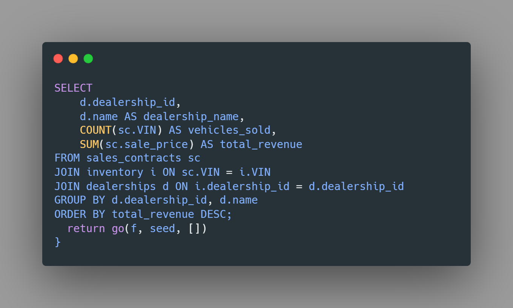

# About Car Dealership Database 💾
For this workshop, our task is to design a comprehensive car dealership database, 
including all necessary tables to support its operations. 
The script must also initialize the database with pre-populated sample data to ensure 
functionality from the start.

# Technology Used 🖥️
For this project, I used SQL tools like `DBeaver` and `MySQL` to design and 
implement the car dealership database. 
This involved creating structured tables, populating them with initial data, 
and writing SQL queries to validate functionality. Additionally, 
I generated an SQL file to test and ensure the database operates correctly.

# Roadmap 🏗️
1. I began by reviewing the project documentation to identify the essential components of the car dealership database, including necessary tables, relationships, and initial data.

2. I created my first SQL file, `Dealership_Creator.sql`, which includes:

* Database Setup: Drops the existing CarDealership database if it exists, then creates and selects a fresh one.

* Dealerships Table: Stores dealership info (dealership_id, name, address, phone). AUTO_INCREMENT ensures unique IDs.

* Vehicles Table: Tracks vehicles by unique VIN, including make, model, year, color, price, and sold status.

* Inventory Table: Links dealerships and vehicles via foreign keys, establishing which dealership has which vehicle.

* Sales Contracts Table: Logs sold vehicles by VIN, recording customer name, sale date, and price.

* Lease Contracts Table: Manages leased vehicles, storing customer info, lease terms, and monthly payment by VIN.

3. Created another SQL file named `Dealership_Data.sql` this file populates my car dealership tables
It has the following data:

* `Insert Dealerships`
Adds six dealerships with their name, address, and phone number into the dealerships table.

* `Insert Vehicles`
Populates the vehicles table with 12 entries, each identified by a unique VIN, including details like make, model, year, color, price, and sale status.

* `Assign Inventory`
Links each vehicle to a specific dealership by inserting pairs of dealership_id and VIN into the inventory table.

* `Insert Sales Contracts`
Adds records of sold vehicles into sales_contracts, capturing the VIN, customer name, sale date, and final price.

* `Insert Lease Contracts`
Adds leasing details into lease_contracts for specific vehicles, including customer info, lease period, and monthly payments.

4. Created the last sql file named `Dealership_Queries.sql` this has the following:
* `List All Dealerships` -
Retrieves all dealerships, ordered alphabetically by name.

* `Show Vehicles at a Dealership` -
Gets vehicle details for a specific dealership by ID or name.

* `Find Vehicle by VIN` -
Retrieves vehicle information using its VIN (e.g., find a Honda Civic).

* `Locate a Vehicle's Dealership` -
Finds which dealership a vehicle (by VIN) is located at, including dealership and vehicle details:

a. Find Dealerships with Specific Vehicle Types

b. By Make: Dealerships carrying a brand (e.g., Honda).

c. By Model: Dealerships with a specific model (e.g., Civic).

d. By Model Group: Dealerships with model types (e.g., SUVs like Explorer, CX-5, Sorento).

`Sales Report for a Dealership in a Date Range` -
Shows all vehicles sold by a specific dealership in a defined time window (e.g., May–June 2025), with full customer and vehicle details.

# Interesting Query 👀🔍

I found this query interesting because it ranks dealerships by total vehicle sales revenue, revealing how many cars each dealership sold and the income they generated. It’s a great way to highlight the top performers using real sales data.

 

