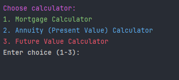

# Workshop 1 Financial Calculator 🧮
This project is a simple Java Calculator that provides a set of financial calculators for clients and using the Java Terminal to see a mortgage, future and present values of anything you like
such as a house or just looking into anything else you can think of.

# Roadmap 🚧
1. Read the Workbook 1 Financial Calculators and created the classes needed for this project.
2. Created the classes needed for the project to work Main, mortgageCal, futureVal, and presentVal.
3. Went into the mortgageCal class and first set up a program that prompts the user to input the loan principal, annual interest rate, and loan term in years. Then, implement the mortgage payment formula using those inputs to calculate and display the monthly payment and total interest paid.
4. Then went into my futureVal class and prompt the user to input the deposit amount, annual interest rate, and number of years. Then apply the daily compounding formula to compute and display the future value of the deposit and the total interest earned.
5. Next went into my presentValue class and prompt the user to enter the monthly payout amount, annual interest rate, and number of years. Then calculate and display the present value using the formula for the present value of an ordinary annuity.
6. To finalize the program, I went into the main method and created instances of all the calculator classes, using the Scanner class to gather user input for each one. This allowed the program to interactively prompt the user and display the results for each calculator directly in the terminal.

# ScreenShots 📷

This is the home screen that when you choose a number it will take you to one of 3 calculators Mortgage (1), Annuity (Present Value) Calculator (2), and Future Value Calculator (3).

This is the Mortgage screen where can enter the loan amount, annual interest rate, and loan term in years to get the Monthly Payment and Total Interest Paid.

Next is the Present Val screen where you can Enter monthly payout, annual interest rate, and number of years to get the Present Value of the Annuity.

And lastly the future value screen where you see the Enter deposit amount, annual interest rate and number of years to get the Future Value and the Total Interest Earned
