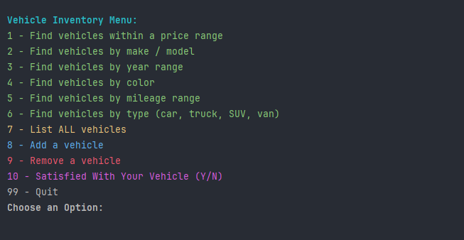
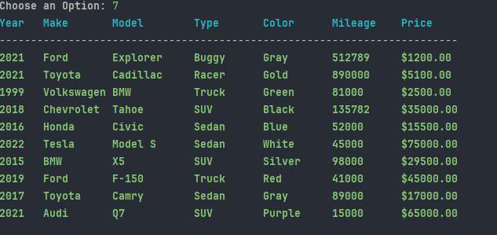
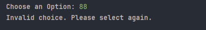
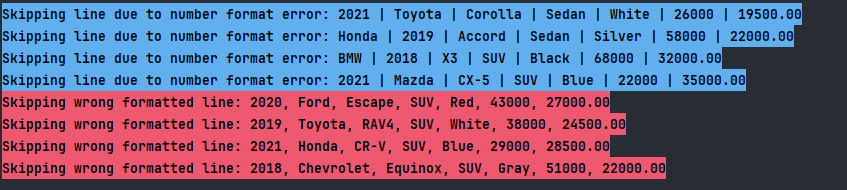
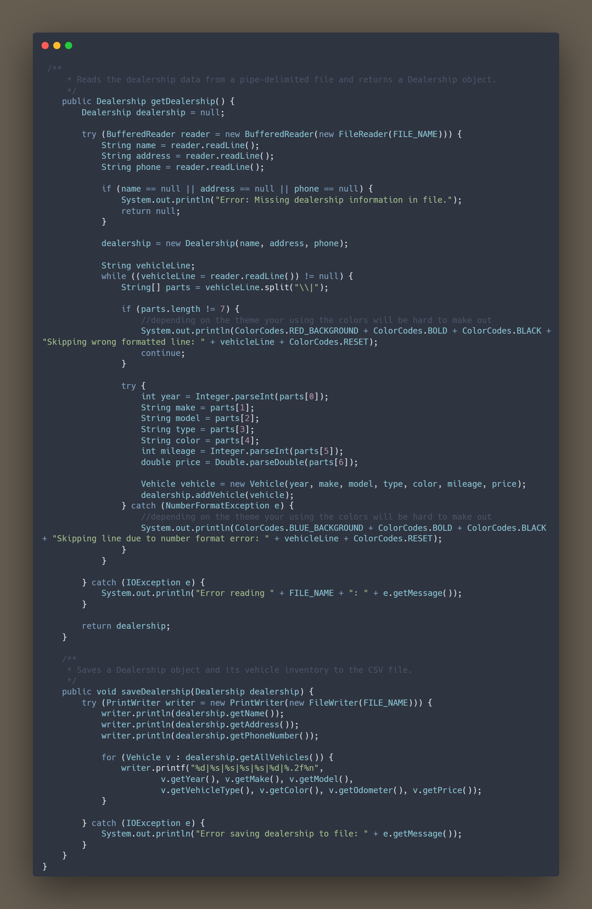

# Car Dealearship Using Object-Oriented Programming WS4
This project uses Object Oriented Programming to simulate a Car Dealership using Getters and Setters, Constructors, File Read and Write, and a few error catchers to simulate a Car Dealership. And using IntelliJ to make this project 

## Roadmap

- 1st, I looked through the documentation to see what was needed in each class, and I was very careful to follow the instructions exactly 

- 2nd, once I was done looking over the documentation made all the classes need to make a functioning app. 

- 3rd Look at every class and add the needed code to complete this project.

I started with Vehicle because that was the easiest, all it needed was setters and getters of ints, strings and doubles.

Next, I went to my Dealership class, which asked me to use an array list to get the Vehicle's Price, Model, Year, Color, Mileage, and Type. Also, within the Dealership class, I needed to add the ability to add or remove vehicles from the list and List all the vehicles present at the time.

Then I went into my DealershipFileManager class to make use of the BufferReader class and the  PrintWriter Class to simulate reading and writing from the file

Next, I went into my UserInterface class, which was the hardest to do. This class asked the user what car they were looking for by year, color, make, and model, as well as adding and removing vehicles from the Dealership list. As a bonus, if they weren't satisfied, they could call a simulated number.

Last, just adding the UserInterface ui to the Main to make the code work in the console. 

# Screenshots of How my Code Works

As you can see you see my home screen you can choose any option 1 - 10, and 99 to execute any of the options listed.

If you push 7 you can see all the listed cars, make / model, color, the odometer and the price for each car in the inventory.csv file.

If you enter any other number other than 1 - 10 and 99 you will get Invalid Choice. Please Try Again

An error I decided to highlight is that sometimes due to human error people will enter data wrong in a file and I highlighted it in the file just in case any got it wrong they can change it using:
.     
However, if you use this it will erase the wrong files and just put in the one you changed or just adding a new vehicle. 

Another Thing you might have noticed is that I have colored and highlighted when you run the main you can see how my code works I used a class called ColorCodes that have all the colors that I used to make my Dealership look interesting and show if there are issues you can change them and make all the options colorful as well.

## Screenshots of Code I found Interesting 

I had to learn how to use this because the inventory.csv file contained all the items; it wasn't formatting correctly, so I had to make an error handler to see if any information needed to be corrected for the user to correct it in the file. Another issue I have come across was that if there is any wrong format for the inventory, it will get erased, so when you see the errors, you need to put the info or it will be gone.

## Special Thanks 

Thank you to one of my teammates who helped me find a good Readme creator called https://readme.so/ to help make this readme template, and using https://carbon.now.sh/ to create the screenshot above, and to my professor who caught little issues like my name conventions and little mistakes that I missed when making this project.
