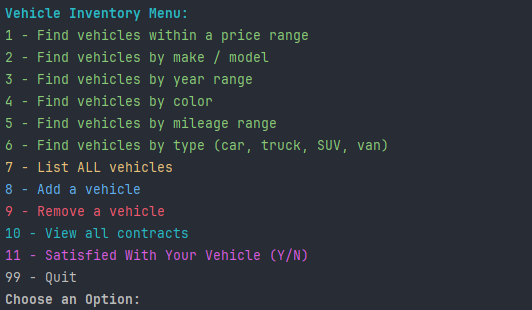

# Car Dealearship Using Object-Oriented Programming WS4 Pt 2 📄
This project is part 2 of https://github.com/Year-Up-United-SPR-2025/Workshops/tree/main/ObjOriCarDealership with the added bonus of keeping track of contacts. Using IntelliJ to create this project using Getters and Setters, Constructors, File Read and Write, and a few error catchers to simulate a Car Dealership. 

# Roadmap 🚧

* 1st, I looked through the documentation to see what was needed in each class, and I was very careful to follow the instructions exactly.
* 2nd, once I was done looking over the documentation made all the classes need show the contacts that people have with the car dealership.
* 3rd, Look at the classes and added the needed code to make the contact work.

1. 📜 I started with bring over my previous code from part 1.

 
2. 💼 I went to my Contract class and made it an abstract class like the need so that my other classes that needed Contract class to extend from. 
All that is in Contract is private date, customerName, customerEmail and vehicleSold. 
With that generated the constructors, setters and getters. I also to create an abstract method for getTotalPrice and getMonthlyPayment so that can be used by my other classes as well.

3. 👨🏾‍💻 I went into my SalesContract class and made it ino an extension of Contact class. 
Right there I had an error because Contact is abstract and usually needs a contractor to get into so had to make my variables and create a constructor afterward to make my app build with no issues. 
Another thing in this class I needed to look up how to do the formula for calculating finding the amortization formula which was  M = P * (r(1+r)^n) / ((1+r)^n - 1).

4. ⭐ Went into my LeaseContract class and took my code from SalesContact class and matched what was needed like finding the Expected Ending Value = %50 the Lease Fee = %7, leases are financed at 4% and the monthly payment which was over 36 months or 3 years.

5. 😎 Created a class named ContactFileManage with reads the Contact.csv file and prints out what is in the file.
This took me a while to figure out because the read file class needs quite a few appends and what line of getters it needs to read correctly. If you can see in my folders I have another csv file just in case something doesn't read correctly and might overwrite the fields in my file.

6. 🛞 Lastly went back into my UserInterface class and added  a new field named processViewContracts() so that you can see the contracts each person has. 
 

# Screenshots 📷

As you can see now my home screen has an added filed of viewing the contacts that the customer has.

This is the list you see when you press 10  to view all contracts.

This is an error if you put the csv file name wrong, and you need to stop the app to fix it in the code.

# Interesting code 👀

This code was interesting because it came from the SalesContact file and change some variables to make the LeaseContact work.

## Special Thanks 👋🏾
Thank you to one of my teammates who helped me find a good Readme creator called https://readme.so/ to help make this readme template, and using https://carbon.now.sh/ to create the screenshot above, and to my professor who caught little issues like my name conventions and little mistakes that I missed when making this project.