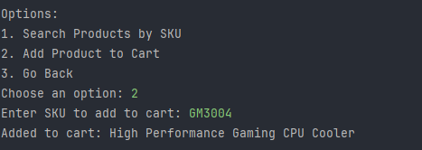
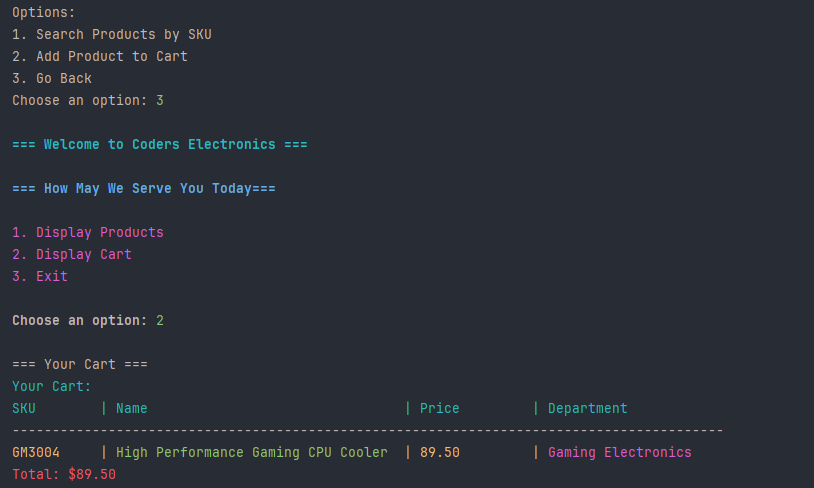
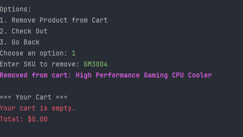
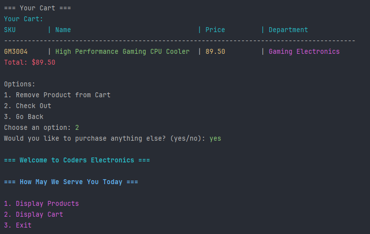
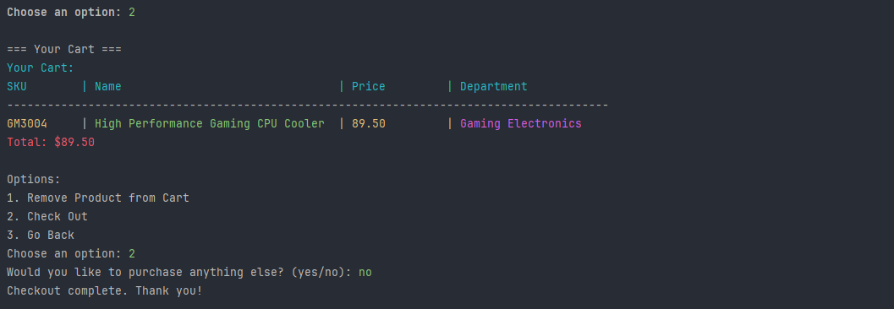

# Workshop 3 Online Store 🏪
This Java project simulates an Online Store built in IntelliJ using core Java features like file I/O, lists, 
and user input via the Scanner class. It supports product management, a shopping cart, and screen-based navigation, 
all with proper error handling and colorful terminal output. The application is fully menu-driven, offering an online store experience through a console interface.

# Roadmap 🚧
1. Looked over the documentation to see what was needed and figure out what every class needed.
2. Next created my classes that I needed which were Main,File_Reader_and_Writer, Product, and UserInterface classes. Also, implating later a ColorCodes class that adds color to the terminal.
3. First I went in to my Product class to create the private fields named sku, productName, productPrice, and Department. Once created used the 
generated fields to create a constructors and the getter and setters that are needed to be used by my other classes to work.
4. I updated my File_Reader_and_Writer class to include the necessary fields and methods for creating and saving a product to a file, reading products from Products.csv, removing products from the file, and viewing all products stored in it.
5. Went into my UserInterface Class to create the fields needed to simulate "Screens" for the user to show a Store Home Screen that displays:
*  Display Products - Displays a list of products that your store sells. Adding a search/filter option to find a specific product. Adding a product to their cart and a Go back to go back to the home page.
*  Display Cart - displays a list of line items that are in the customer's cart while also showing the total sales amount of the cart. While at the Display Cart Screen the could also Check out, Remove a product from their cart and go back to the home screen. 
*  Exit - closes out of the application
6. Next called the User Interface in Main to simulate the application.
7. Lastly added color to the code outputs when you are using the code to make my Online Store App look more eye catching to the users.

# Screenshots 📸

This is start of my Home Screen as you can se you see the Name of the store a greeting and three options and by press 1 - 3 you can interact with the terminal. However, if you select any number besides 1 - 3 you get this message:

---

Once you select 1 you can see the list of products by SKU, Name, Price, and which Department they are in.

*** 

Once you find a product you can search it again to make sure it there like in the screenshot.

---

Once you find the product select 2 and add it to your cart

---

After that go back to home and see your cart and how much everything costs 

---

If you don't want the item in your cart you can remove by pressing 1 and displaying that its gone and the amount of how much your cart is worth

---

Now at the checkout page you can check out, or you can and go back to the home or just chek out like this:

# Code I Found Interesting 

One of the most interesting parts is the readProducts() method in File_Reader_and_Writer, especially the formatted color-coded console output, which enhances readability and user experience. Another key line is cart.add(line); in addToCart(), showing a simple but effective way to track purchases using in-memory storage. Lastly, the calculateCartTotal() method is crucial, as it computes the total from stored product strings—simple for real-time feedback.
