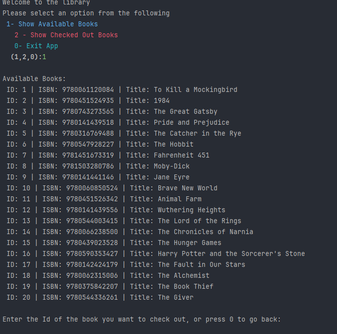
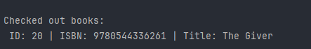
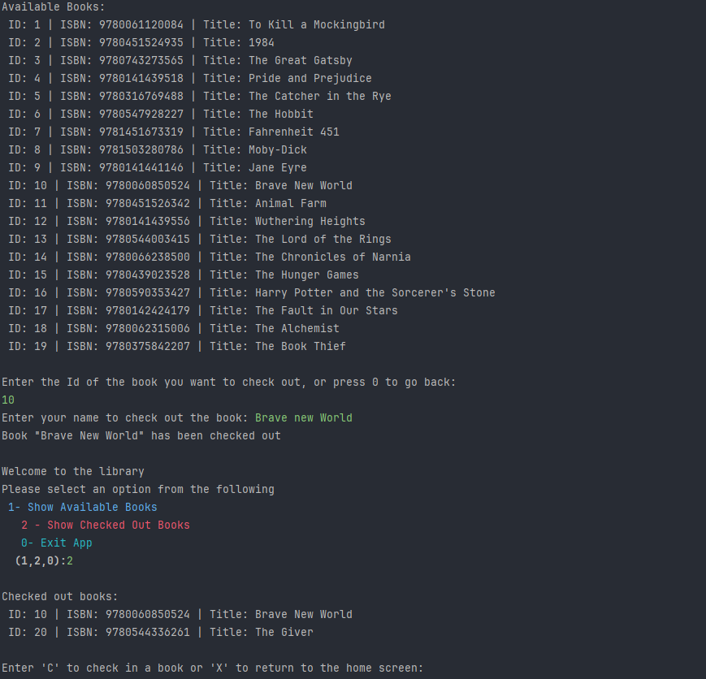

# About Neighborhood Library 📚
This project is making an application that a library uses an honor system to check in books and keeping track of who checked out a book from the library.

# About Project 📔
This workshop was a lot of fun and a great learning experience. 
IntelliJ's helpful features made it easier to generate parts of the code and save time, which was especially useful as I explored building a simple library system. 
This project introduced me to core programming concepts like arrays, loops, and user input, and showed how these tools can be used to track books and their check-out status.

# RoadMap 🚧
1. Looked over the documentation to see what was needed and figure out what every class needed.
2. Next created my classes that I needed which were Book,and Main classes
3. Then went into my Book class with using properties like id, isbn, title, isCheckedOut, and checkedOutTo, along with constructors, getters, setters, and checkOut(name) / checkIn() methods to manage book status. Then, set up an array of at least 20 Book objects to serve as a library's inventory.
4. I then went into the main method to implement a library management system using a Book class and a Main class that handles user interactions through a terminal-based menu. The Main class initializes an inventory of 20 books and uses the Scanner class to capture user input for tasks such as viewing available or checked-out books, checking out a book by ID and username, and checking books back in. The interface includes basic color formatting for a better user experience, and a loop ensures the menu continues displaying until the user chooses to exit the application.

# Screenshots 📸

This is my home screen as you can see you can choose 3 numbers 0 - 2 any other number will give you an error : 

This is the list of books you can check out when pressing 1

Once you check out by pressing in 1 - 20 you will be asked to type out the book name and it will be checked out. You may also see that I typed out in lower case 
I made sure that if you checked out a book in lowercase it will still check out the book.

Once checked out you can press 2 and see the list of checked out books and you could check it back in or just go check out another book like so:

# Issues 
Even though I ran into a few challenges—like figuring out how to update a book’s status, dealing with spelling errors, and getting curly braces in the right places—I enjoyed the problem-solving process.
I also learned the importance of good code structure and encapsulation; not all code should be visible to the user, and it's crucial to keep some fields private to maintain a clean, secure design.
